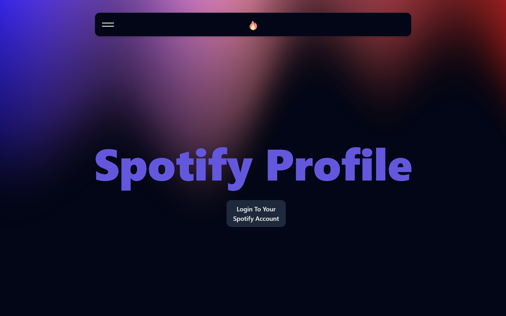
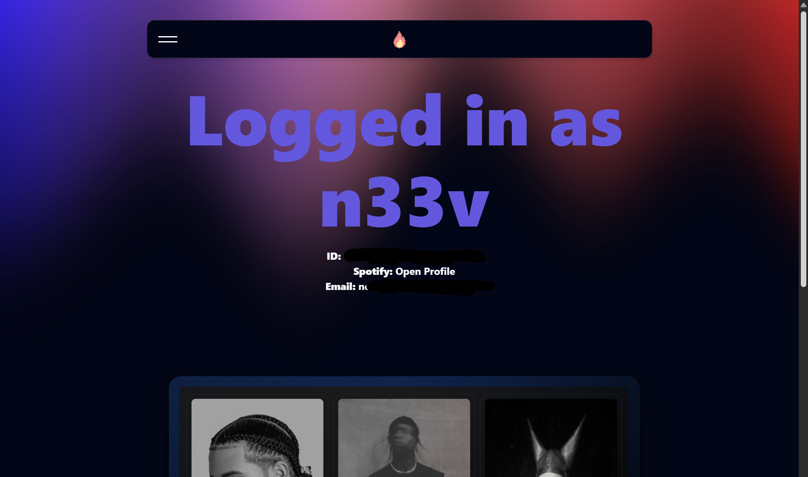
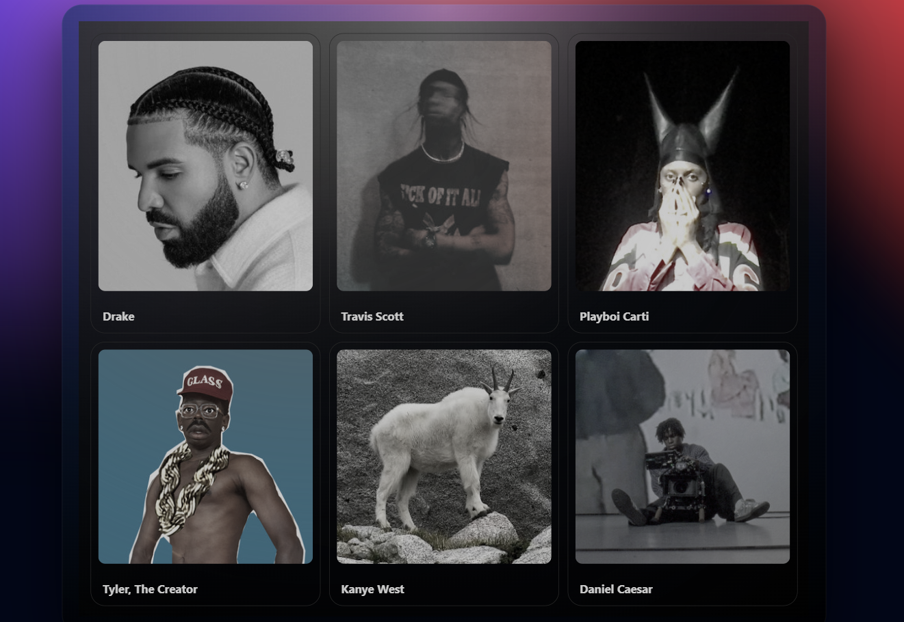

# Spotify Profile Viewer (Full Stack)

This is a simple full-stack web application that lets users log in with their Spotify account and view their profile information using the Spotify Web API.

I built this project while learning how APIs actually work in practice — especially OAuth authentication, handling access tokens on the backend, and sending data to a React frontend.

## Screenshots

### Login Page


### Profile Page



## Project Structure

```
REACT/
├── React stuff/     # React (Vite) frontend
├── Backend/         # Node.js + Express backend for Spotify OAuth
└── README.md
```

I kept the frontend and backend separate to make the flow easier to understand and maintain.


## What This App Does

- Lets users log in using their Spotify account
- Handles Spotify OAuth securely on the backend
- Fetches user profile data from Spotify
- Sends the data to the frontend
- Displays the profile information in the UI


## Tech Used

### Frontend
- React (Vite)
- JavaScript
- HTML & CSS

### Backend
- Node.js
- Express
- Spotify Web API

## Acknowledgement

I’d like to give a huge shoutout to **React Bits** for their excellent collection of React components and backgrounds.

As a complete beginner, these resources made it much easier to build a clean UI and stay focused on learning how APIs and full-stack applications work.

Components used are: 
- Aurora Background
- CardNav Component



## How It Works (Simple Explanation)

1. The user clicks **Login with Spotify**
2. The backend redirects the user to Spotify’s login page
3. Spotify asks for permission
4. Spotify sends an authorization code back
5. The backend exchanges this code for an access token
6. The backend uses the token to fetch profile data
7. The frontend requests this data from the backend
8. The user’s profile is displayed on the screen


## Getting Started (For Beginners)

If you’re new, just follow these steps one by one:-

### Prerequisites

Make sure you have:
- **Node.js** installed  
  https://nodejs.org/
- **Git** installed  
  https://git-scm.com/
- A **Spotify account**


### Clone the Repository

---

```bash
git clone https://github.com/your-username/Spotify-User-Profile.git

cd Spotify-User-Profile
```


### Spotify Developer Setup
---

1. Go to https://developer.spotify.com/dashboard
2. Create a new app
3. Copy your **Client ID** and **Client Secret**
4. Add this **Redirect URI**:
   ```
   http://localhost:5000/callback
   ```


### Backend Setup

```bash
cd Backend
npm configure
```

Create a `.env` file inside the `Backend` folder:

```env
SPOTIFY_CLIENT_ID=your_client_id
SPOTIFY_CLIENT_SECRET=your_client_secret
SPOTIFY_REDIRECT_URI=http://localhost:5000/callback
```

Start the backend:

```bash
npm start
```

The backend should now be running on port number : `8888`.


### Frontend Setup

Open a new terminal:

```bash
cd "React stuff"
npm install
npm run dev
```

The frontend will start on:
```
http://127.0.0.1:5173
```


## Using the App

1. Open the frontend URL in your browser
2. Click **Login with Spotify**
3. Approve access
4. View your Spotify profile information


## Planned Improvements

- AI-based music taste roasting using Gemini API
- Showing top artists and tracks
- Better UI and styling
- Improved error handling


## What I Learned From This Project

- How OAuth authentication works
- How to use third-party APIs securely
- How frontend and backend communicate
- How to structure a basic full-stack project
- How to work with real API responses


## Notes

- `node_modules` and `.env` files are ignored for security reasons
- This project was built for learning purposes
- Feedback and suggestions are welcome


## Author

Built by **Neev**  
IT Student | Internship Seeker 
